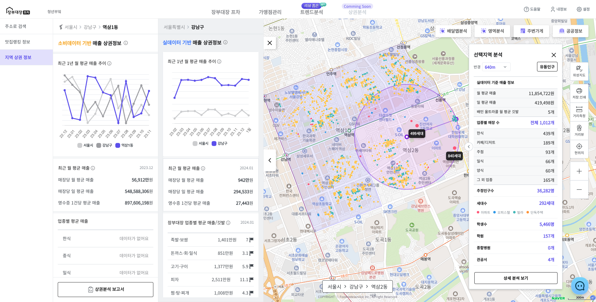

# 프차 상권분석 서비스를 소개합니다.

<figure><figcaption></figcaption></figure>

### **🧐 장부대장 프차 고객센터**

* 💬 [장부대장프차 채널](https://app.gitbook.com/o/sy08eLUqVi3HysXsBcY2/s/l0nW5B9Df1O3p3VZctYU/)을 추가하시면 카카오톡으로 상담을 시작하실 수 있습니다.
* 📞 고객센터: 02-1533-1753
