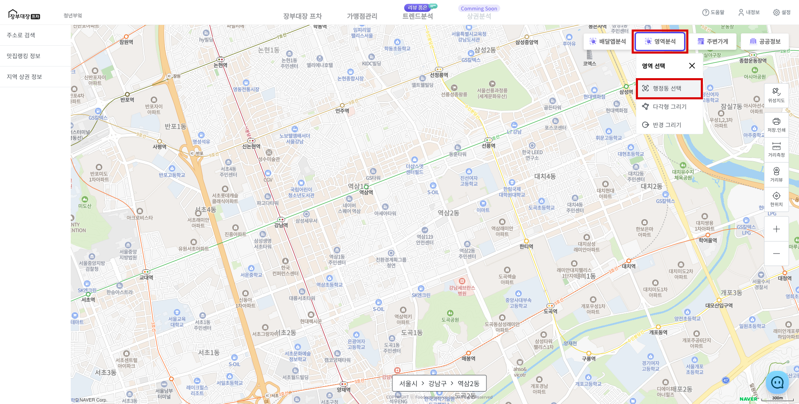
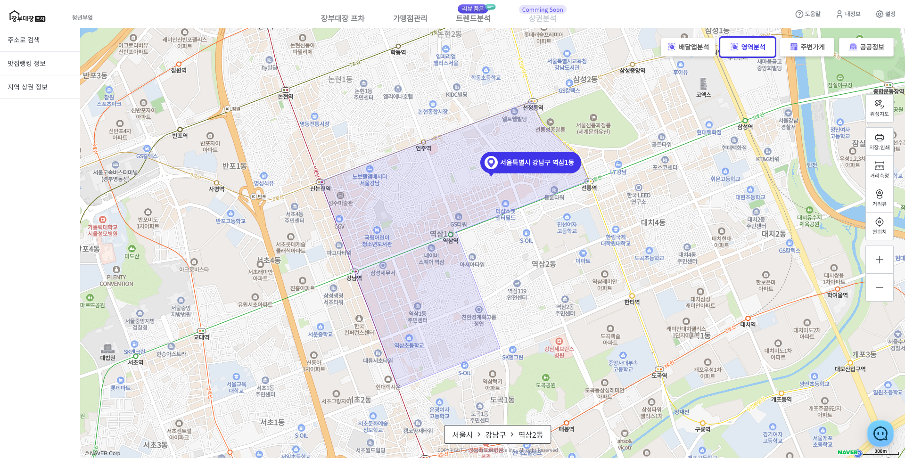
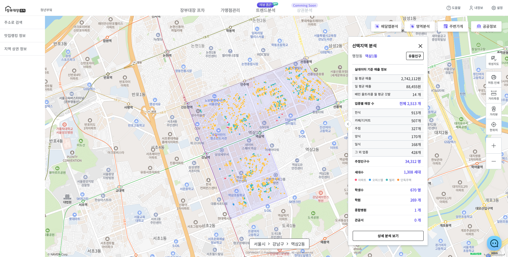
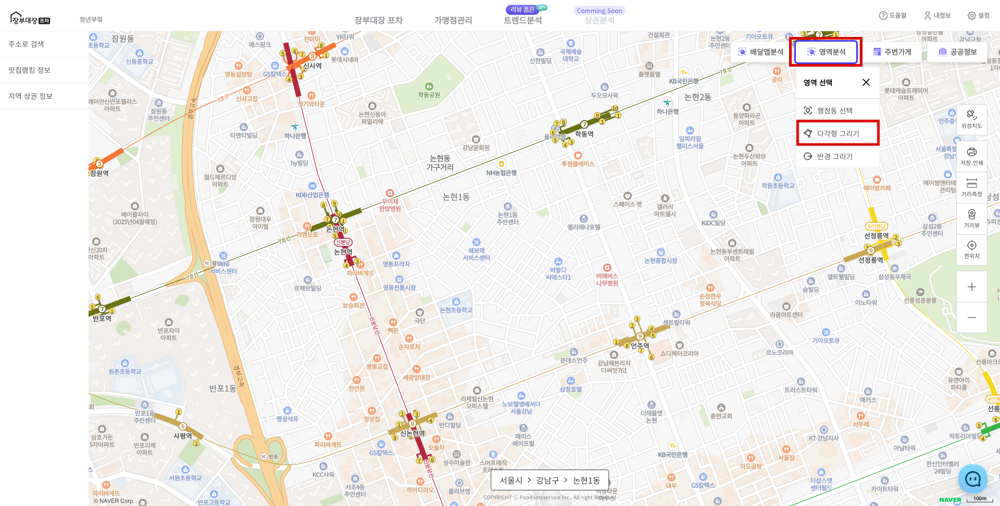
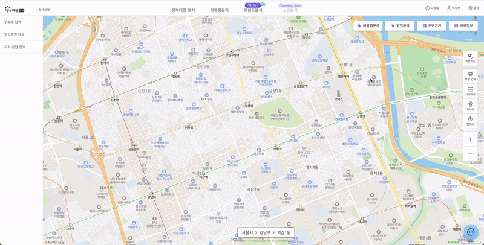
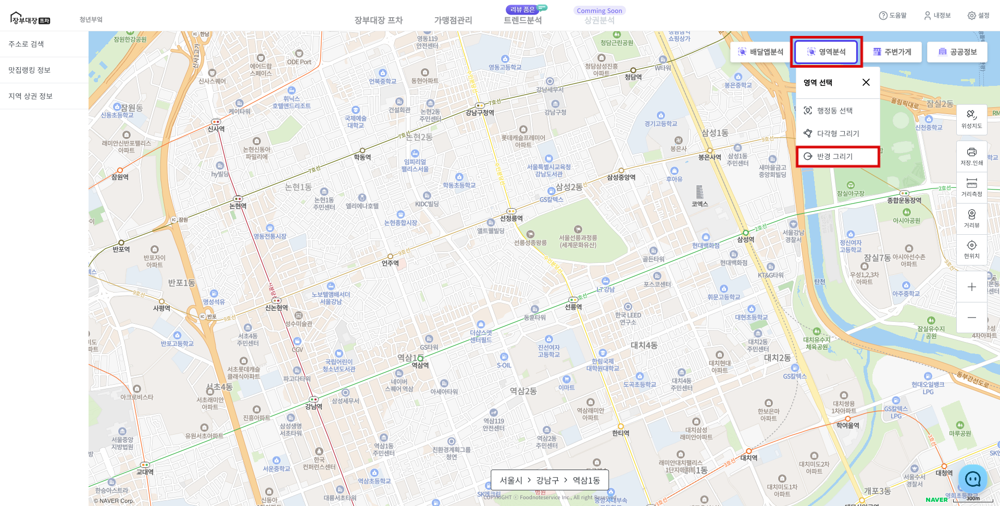
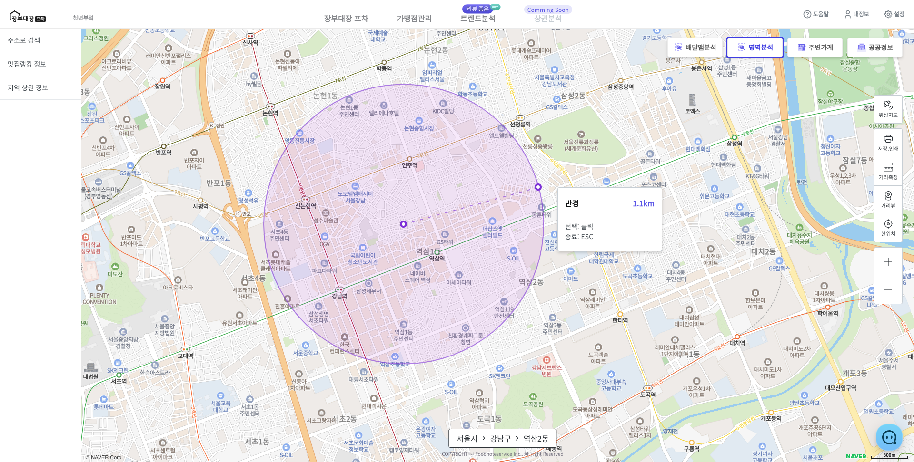
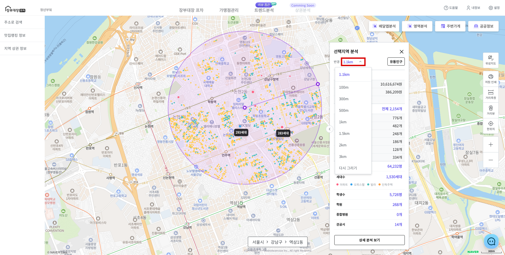

# 영역 분석

## 1. 행정동 선택하기

* [희망하는 지역으로 지도를 이동합니다.](move.md)
* 오른쪽 상단 **\[영역분석]** 클릭 후 **\[행정동 선택]** 버튼을 선택합니다.

<figure><figcaption></figcaption></figure>

* 마우스 포인터의 주소가 표시 되며 원하는 지역의 행정동을 선택할 수 있습니다.
* **마우스 클릭**하여 행정동을 선택하거나 **\[ESC]** 키를 눌러 취소할 행정동 선택을 취소할 수 있습니다.

<figure><figcaption></figcaption></figure>

* 행정동 선택 시 인구, 유동인구, 매출, 세대수 정보를 포함하는 **\[인포윈도우]**가 표시됩니다.

<figure><figcaption></figcaption></figure>

## 2. 다각형 그리기

* [희망하는 지역으로 지도를 이동합니다.](move.md)
* 오른쪽 상단 **\[영역분석]** 클릭 후 **\[다각형 그리기]**를 선택합니다.

<figure><figcaption></figcaption></figure>

* 여러 개의 점을 찍어 원하는 지역을 설정합니다.
  * **\[마우스 우클릭]**으로 설정을 완료합니다.
  * **\[ESC]** 버튼으로 다각형 그리기를 취소합니다.

<figure><figcaption></figcaption></figure>

## 3. 반경 그리기

* [희망하는 지역으로 지도를 이동합니다.](move.md)
* 오른쪽 상단 **\[영역분석]** 클릭 후 **\[반경 그리기]**를 선택합니다.

<figure><figcaption></figcaption></figure>

* 클릭하여 반경 그리기를 시작하여 반경을 조절합니다.
* 그리는 중 **\[ESC]** 키를 누르면 반경 그리기가 취소됩니다.
* 지도를 한 번 더 클릭하면 반경 선택이 완료됩니다.
* 설정한 반경은 결과 정보 창인 **\[인포윈도우]**에서 다시 그리거나 변경할 수 있습니다. (최소 100m \~ 최대 3km)

<figure><figcaption></figcaption></figure>

<figure><figcaption></figcaption></figure>

## 인포윈도우 정보

* 영역분석 완료 시 영역과 결과 정보 창인 **\[인포윈도우]**가 표시됩니다.
* **\[인포윈도우]**는 영역에 대한 인구, 매출, 깃발 관련 정보를 볼 수 있습니다.
* 유동인구, 상세 분석 보기를 통해 추가적인 정보 확인 가능합니다.


* **설정한 영역의 세대수 표시**
  * 250세대 이상일 경우 **세대수 문구**가 표시됩니다.
  * 세대수 마커 색은 다음과 같습니다. <mark style="color:red;background-color:red;">**아파트**</mark>, <mark style="color:blue;background-color:blue;">**오피스텔**</mark>, <mark style="color:green;background-color:green;">**빌라**</mark>, <mark style="color:orange;background-color:orange;">**단독주택**</mark>

