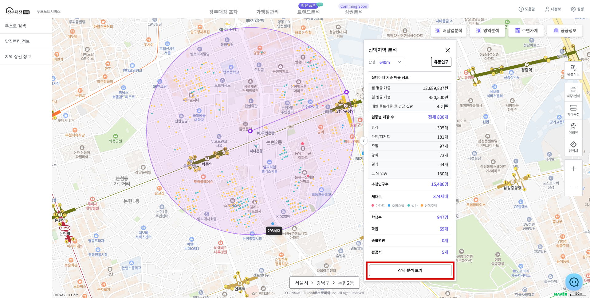
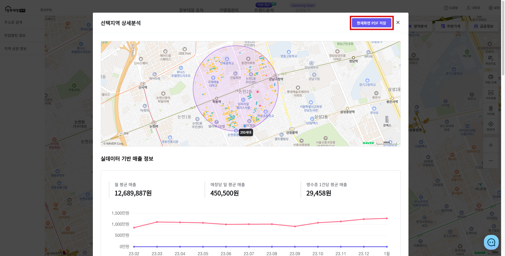
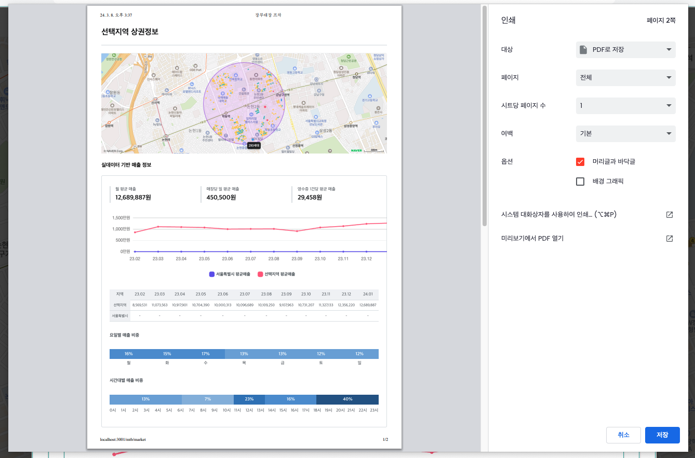
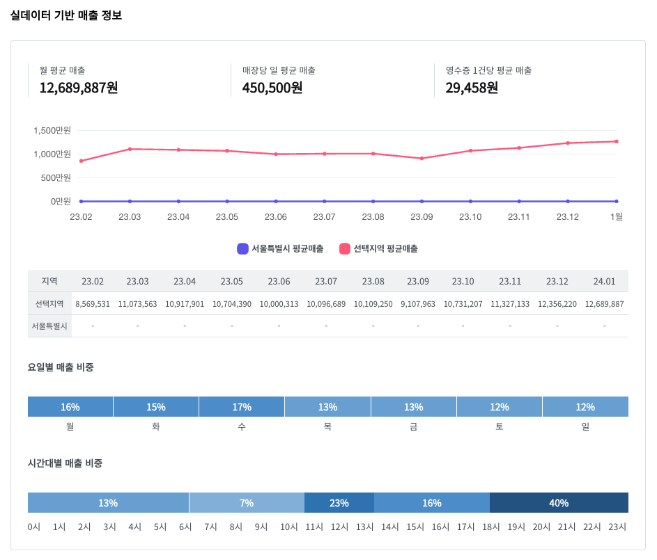
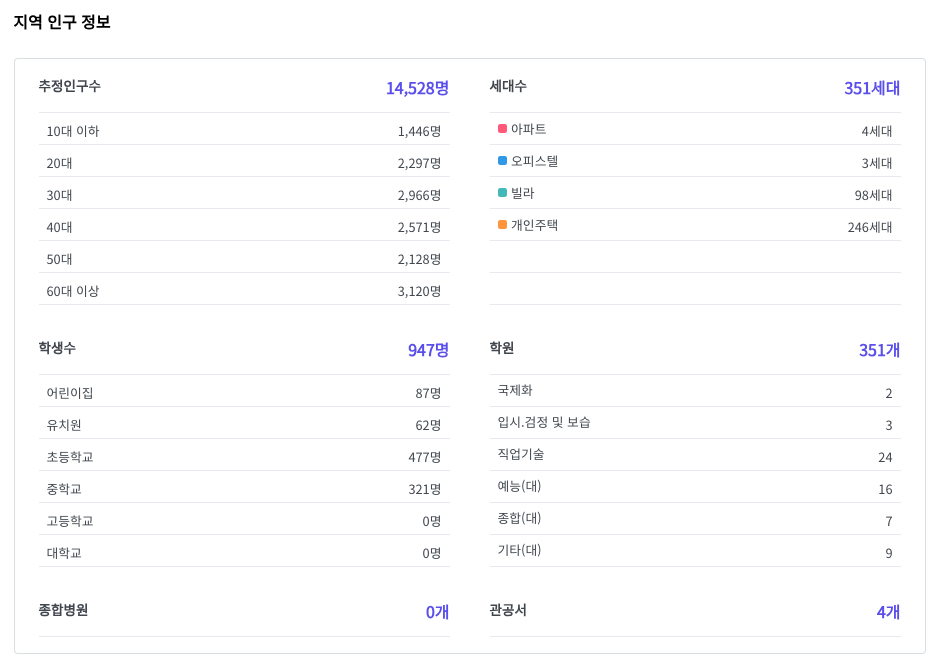
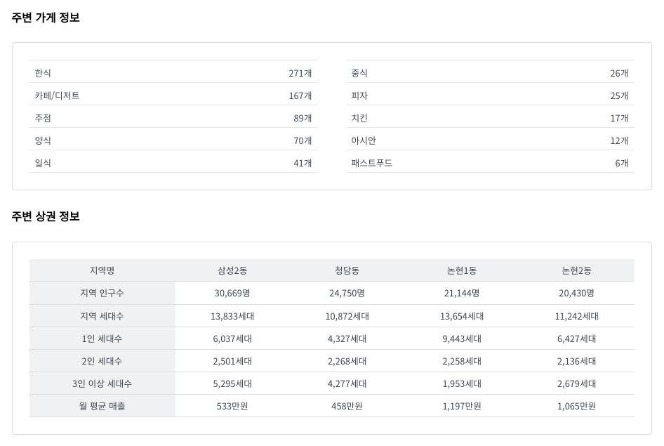

# 상세 분석 보고서 조회

* [**분석 지역 선택**](./)을 선택합니다.
* 분석 결과 창인 **\[인포윈도우]**에서 **\[상세 분석 보기]** 버튼을 클릭 합니다.

<figure><figcaption></figcaption></figure>

* 상세 정보가 모달로 표시됩니다.
* **\[현재화면 PDF 저장]** 버튼을 클릭하여 PDF 저장 또는 인쇄 할 수 있습니다.

<figure><figcaption></figcaption></figure>

<figure><figcaption></figcaption></figure>

* 확인할 수 있는 정보 예시는 다음과 같습니다.



<figure><figcaption></figcaption></figure>



<figure><figcaption></figcaption></figure>



<figure><figcaption></figcaption></figure>


