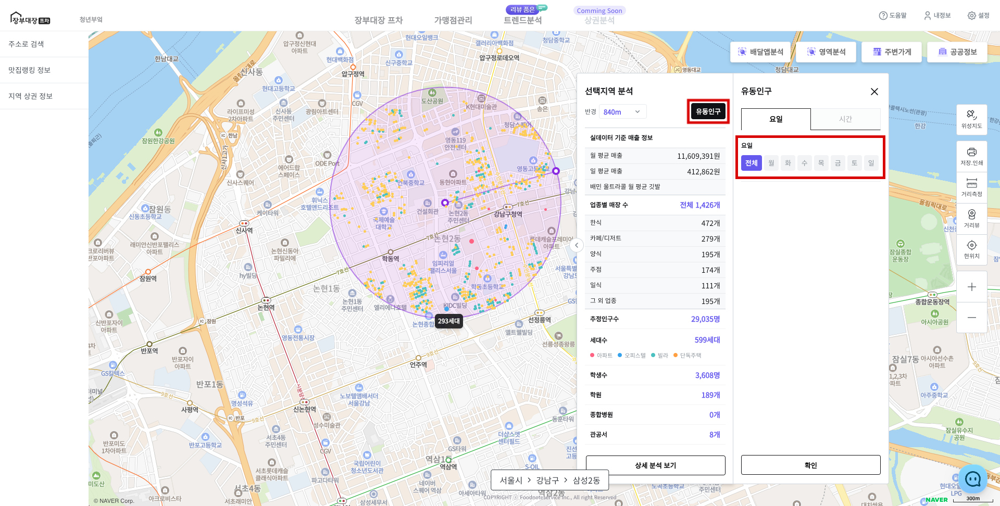
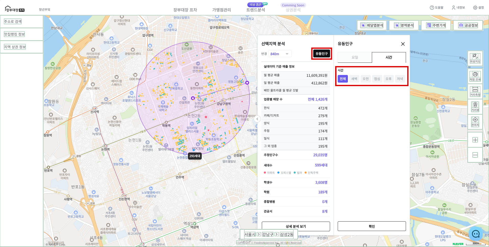
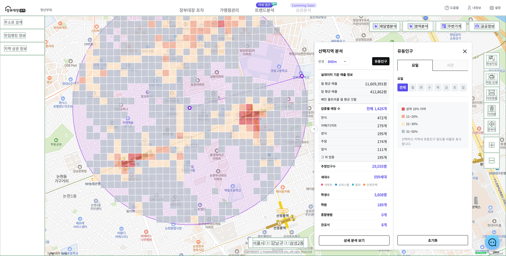

# 유동인구 분석

## 1. 유동인구 설정하기

* 분석 결과 창인 **\[인포윈도우]**에서 **\[유동인구]** 버튼을 클릭 합니다.
* 분석 옵션으로 **요일** 혹은 **시간**을 선택하고 **\[확인]** 버튼을 클릭 합니다.
  * **요일**과 **시간** 동시 선택은 추후 지원될 예정입니다.



<figure><figcaption></figcaption></figure>



<figure><figcaption></figcaption></figure>




시간 옵션의 시간대 구분은 다음과 같습니다.

* **전체**: 00 \~ 23:00
* **새벽**: 00:00 \~ 05:00
* **오전**: 06:00 \~ 10:00
* **점심**: 11:00 \~ 13:00
* **오후**: 14:00 \~ 17:00
* **저녁**: 18:00 \~ 23:00


## 2. 유동인구 분석하기

* 유동인구 데이터가 분석 지역의 정사각형의 **타일**로 표시됩니다.
* 도보 이동이 높은 상위 50% 지역이 표시되며, 타일의 색은 인구 밀도 비율에 따라 달라집니다.
* **\[초기화]** 버튼으로 유동인구 분석을 취소할 수 있습니다.

> * 유동인구는 이동통신사의 기지국 통신 기반 데이터를 활용한 결과입니다.
> * 선택 지역 내 도보이동의 밀도가 높은 블록을 표시했습니다.

<figure><figcaption></figcaption></figure>


유동인구 결과 색상 해석

* <mark style="color:red;background-color:red;">**빨간색**</mark>: 유동인구 상위 10% 이하
* <mark style="color:orange;background-color:orange;">**주황색**</mark>: 유동인구 상위 11% 이상 \~ 20% 이하
* <mark style="color:yellow;background-color:yellow;">**노란색**</mark>: 유동인구 상위 21% 이상 \~ 30% 이하
* <mark style="background-color:blue;">**회색**</mark>: 유동인구 상위 31% \~ 50% 이하

