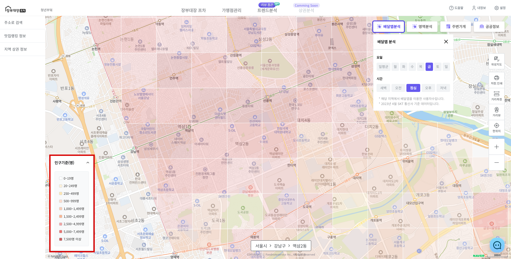

# 배달앱 분석

* 우측 상단 **\[배달앱 분석]** 버튼을 클릭 합니다.
* **\[배달앱 분석]** 버튼은 On / Off 방식으로 동작합니다.
  * 클릭하여 On인 경우 가장자리 테두리가 생깁니다.
  * On일 때 현재 보고있는 지도에 배달앱 분석 결과가 표시됩니다.&#x20;

<figure><figcaption></figcaption></figure>


* SKT 통신사 기준 해당 지역에서 배달앱을 사용한 사용자 수입니다.


* 왼쪽 하단의 **\[인구기준(명)]** 버튼을 클릭하면 색 진하기가 결정되는 기준 인구수를 볼 수 있습니다.

<figure><figcaption></figcaption></figure>

* 배달앱 분석 옵션 선택 창을 닫아도 분석은 유지 됩니다.
* **\[배달앱 분석]** 버튼을 클릭하여 종료시킬 수 있습니다.

<figure><figcaption></figcaption></figure>


* **요일**과 **시간**을 선택하면 바로 분석 결과의 반영 됩니다.
* 기본 값은 **현재 시간 기준**으로 설정 됩니다.


