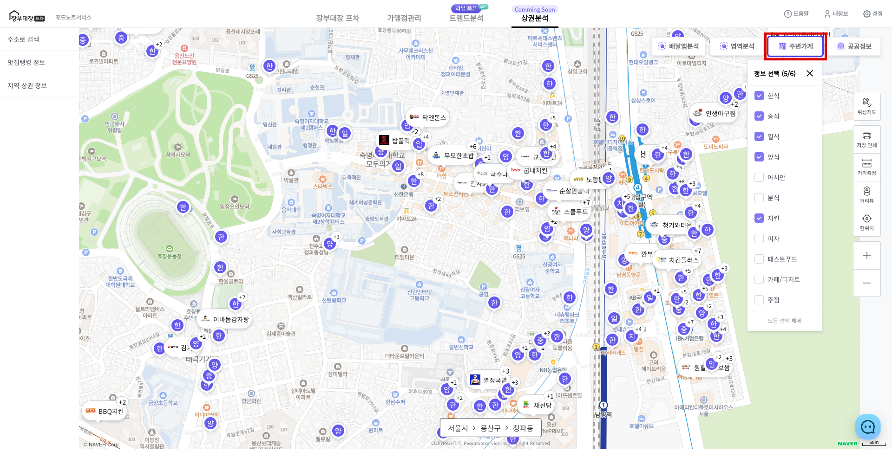
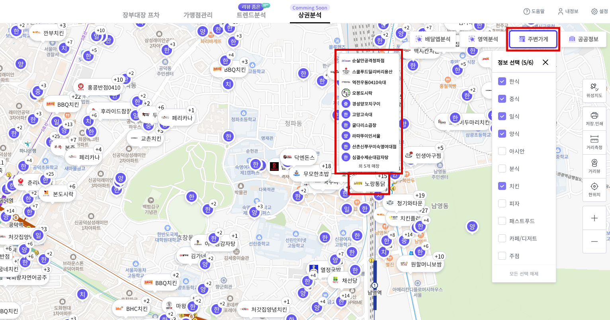

# 주변가게 확인

* 오른쪽 상단 **\[주변가게]** 버튼을 클릭 합니다.
* 지도에 표시할 가게의 **카테고리**를 선택합니다.
* **체크박스** 선택시 지도에 선택한 카테고리의 매장 마커가 표시됩니다.
* **프랜차이즈 매장**은 로고 이미지가 보이며 **비 프랜차이즈 매장**은 업종 앞 글자가 마커로 표시됩니다.
  * **한**(식), **일**(식), **중**(식), **양**(식), **아**(시안), **분**(식), **치**(킨), **피**(자), **패**(스트푸드), **카**(페/디저트), **주**(점)

<figure><figcaption></figcaption></figure>

* 겹쳐있는 마커는 **클러스터링**으로 묶음 처리 되며, 숫자로 겹쳐있는 매장 수를 표시합니다.
* 마우스 오버 시 겹쳐 있는 매장을 확인 할 수 있습니다.
  * 겹쳐있는 매장은 최대 10개 까지 표시됩니다.
* **\[모든 선택 해제]** 버튼으로 한 번에 마커를 지도에서 지울 수 있습니다.

<figure><figcaption></figcaption></figure>


주변가게 마커 표시 조건

* 최대 **6개**까지 선택하여 표시 가능합니다.
* 축척 1:1km 미만일 경우 지도에 마커가 표시되지 않습니다. ( 1 : 3km, 1 : 5km ...)
* 축척 1 : 500m, 1 : 300m일 경우 **프랜차이즈 매장만** 표시됩니다.
* 축척 1 : 100m 이상일 경우 **프랜차이즈, 비 프랜차이즈 매장 모두** 확인할 수 있습니다.

