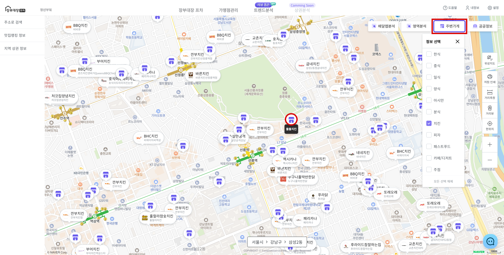

# 주변가게 확인

* 오른쪽 상단 **\[주변가게]** 버튼을 클릭 합니다.
* 지도에 표시할 가게의 **카테고리**를 선택합니다.
* **체크박스** 선택시 지도에 선택한 카테고리의 매장 마커가 표시됩니다.
* **프랜차이즈 매장**은 로고 이미지가 보이며 **비 프랜차이즈 매장**은 기본 매장 마커로 표시됩니다.
* 비 프랜차이즈 매장의 경우 **마우스 오버** 시 **매장명**을 확인할 수 있습니다.

<figure><figcaption></figcaption></figure>


주변가게 마커 표시 조건

* 최대 6개까지 선택하여 표시 가능합니다.
* 축척 1:1km 미만일 경우 지도에 마커가 표시되지 않습니다. ( 1 : 3km, 1 : 5km ...)
* 축척 1 : 500m, 1 : 300m일 경우 **프랜차이즈 매장만** 표시됩니다.
* 축척 1 : 100m 이상일 경우 **프랜차이즈, 비 프랜차이즈 매장 모두** 확인할 수 있습니다.

