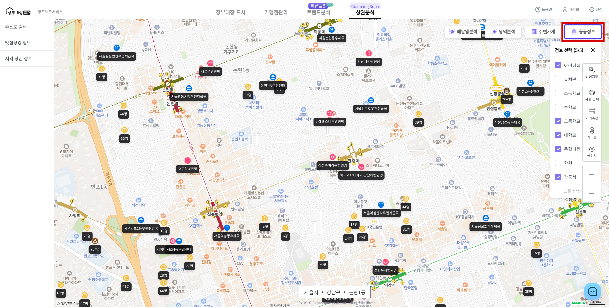
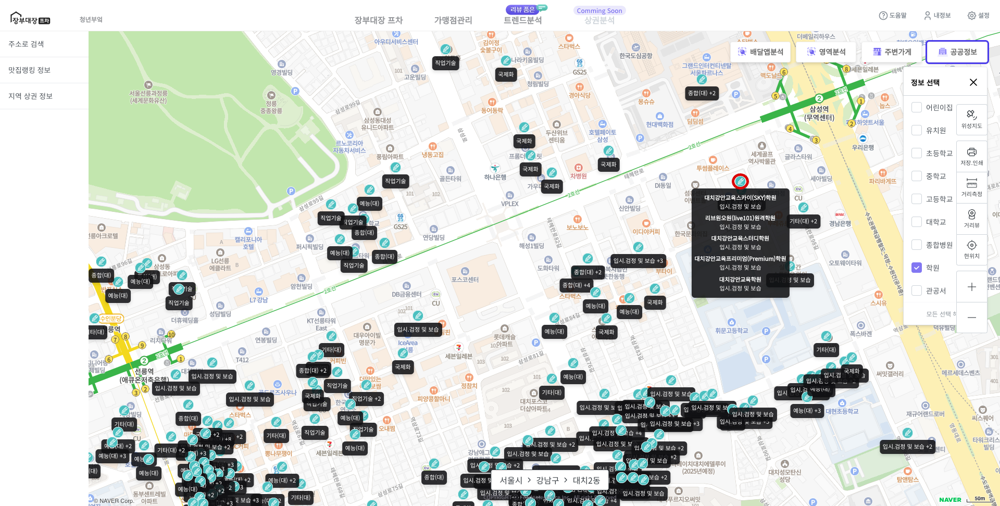

# 공공정보 확인

* 지도 오른쪽 상단 **\[공공정보]** 버튼을 클릭 합니다.
* 지도에 표시하기 원하는 정보를 선택 합니다.
* 체크 박스 선택시 지도에 마커가 표시됩니다.

<figure><figcaption></figcaption></figure>


공공정보 마커 표시 조건

* 최대 5개까지 선택하여 표시 가능합니다.
* 축척 1 : 1km 미만일 경우 지도에 표시되지 않습니다. ( 1 : 3km, 1 : 5km ...)
* 축척 1 : 500m, 1 : 300m일 경우 아이콘만 보이며, 1 : 100m 이상일 때 값과 함께 표시됩니다.


* 표시되어 있는 마커의 "**마우스 오버"하면** 추가 정보가 표시됩니다.
* 같은 위치의 여러 개의 정보가 있으면 "**마우스 오버"하여** 확인할 수 있습니다.
  * 예) 같은 건물의 학원이 여러 개 있는 경우

<figure><figcaption></figcaption></figure>


공공정보 데이터 상세 항목은 다음과 같습니다.

* 유치원 / 어린이집: 원아 수
* 초등학교 / 중학교 / 고등학교: 전체 학생 수, 학년별 학생 수
* 대학교: 전체 학생 수
* 종합병원: 병상 수
* 관공서: 관세, 우정, 지자체, 법무, 국세, 보훈, 경찰, 병무, 고용 관공서 이름

