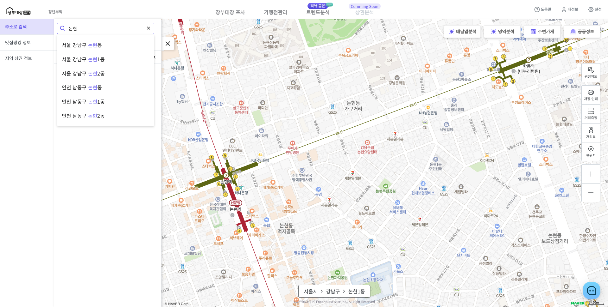
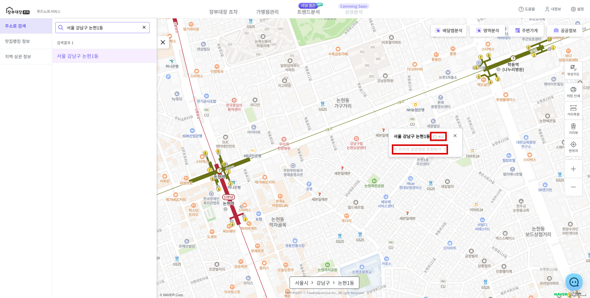

# 주소로 검색하여 지역 찾기

* 도로명/지번 주소 혹은 지역 키워드를 입력하여 검색 가능합니다.

<figure><figcaption></figcaption></figure>

* 찾은 지역의 주소를 복사할 수 있습니다.

<figure><figcaption></figcaption></figure>

* **\[이 위치의 상권정보 조회하기]**를 클릭하면 찾은 주소가 ["지역 상권 분석하기"](dong.md)로 연결 됩니다.
