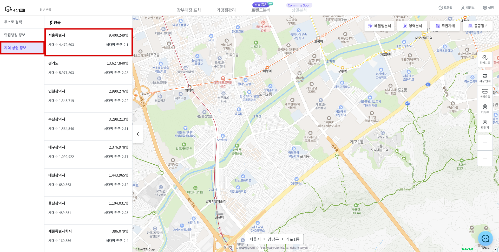
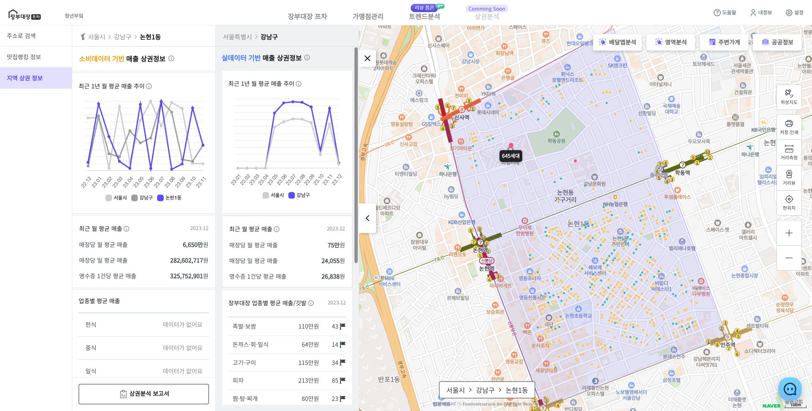
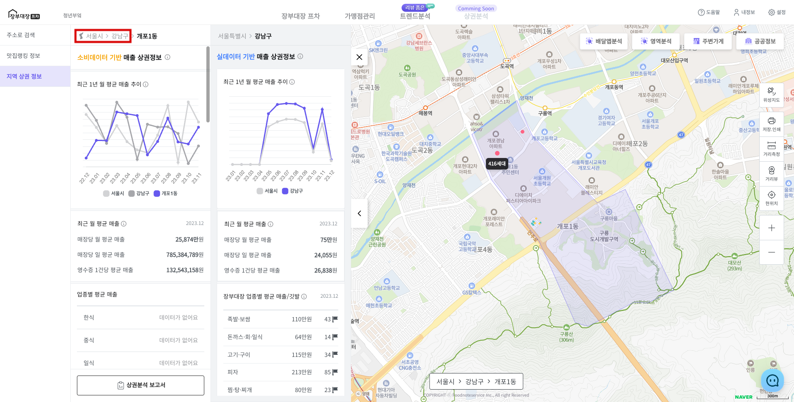
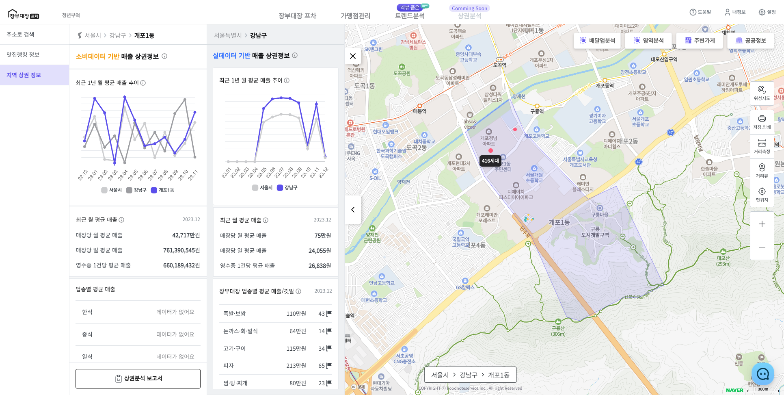
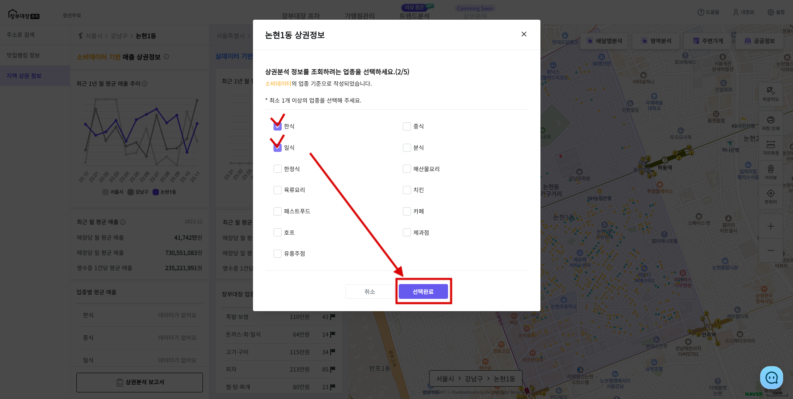
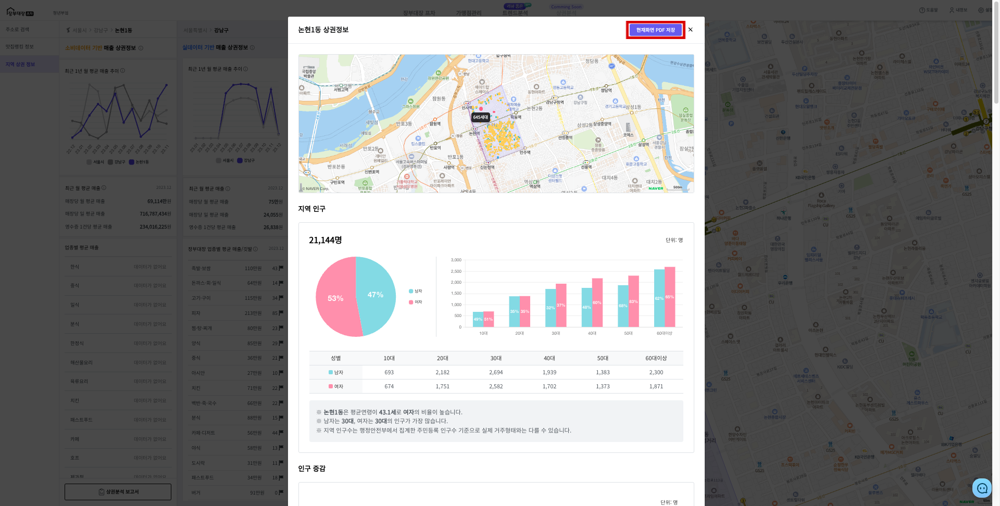

# 지역 상권 분석

## 1. 지역 선택하기

* 사이드바 **\[지역 상권 정보]**를 클릭합니다.

<figure><figcaption></figcaption></figure>

* 행정구역 **시도** / **시군구** / **읍면동**을 차례로 선택합니다.
* **읍면동**까지 선택 시 해당 지역으로 이동하고 상권 정보를 볼 수 있습니다.

<figure><figcaption></figcaption></figure>

* 상단 **\[지도아이콘 > 시도 > 시군구]** 클릭시 이전 행정구역에서 다시 지역 선택 가능합니다.
  * ex) **\[강남구]** 클릭 -> 개포1동, 개포2동,  논현1동, 논현2동 등 선택 가능
  * **\[시도]** -> 구 선택
  * **\[지도아이콘]** -> 시도 선택

<figure><figcaption></figcaption></figure>

## 2. 매출 정보 확인

<figure><figcaption></figcaption></figure>


* <mark style="color:yellow;">**소비데이터 기반**</mark>: BC카드 데이터를 기반으로 <mark style="color:red;">읍면동</mark>의 매출 데이터를 표시합니다.
* <mark style="color:blue;">**실데이터 기반**</mark>: 장부대장 프차 사용자를 기준으로 <mark style="color:red;">시군구</mark>의 데이터를 표시합니다.


## 3. 상권 분석 보고서 확인(PDF 저장 / 출력)

* 사이드바 하단 **\[상권분석 보고서]** 버튼을 클릭합니다.
* 해당 지역의 상권정보를 조회하려는 **업종**을 선택합니다.&#x20;
  * 소비데이터(카드사 기반 매출 데이터)를 **업종별 보고서 형태**로 화면에 표시합니다.

<figure><figcaption></figcaption></figure>

* 지역의 상권 분석 정보를 **보고서 형식**으로 조회 할 수 있습니다.
  * **\[현재화면 PDF 저장]** 버튼으로 PDF 저장 및 출력할 수 있습니다.

<figure><figcaption></figcaption></figure>

* 인구, 매출, 세대수에 대한 정보의 관한 추가 정보도 확인할 수 있습니다.



<figure><figcaption></figcaption></figure>



<figure><figcaption></figcaption></figure>



<figure><figcaption></figcaption></figure>



<figure><figcaption>
카드사 매출 데이터 기준(읍/면/동)
</figcaption></figure>

<figure><figcaption>
장부대장 프차 사용자 실데이터 기준(시/군/구)
</figcaption></figure>



