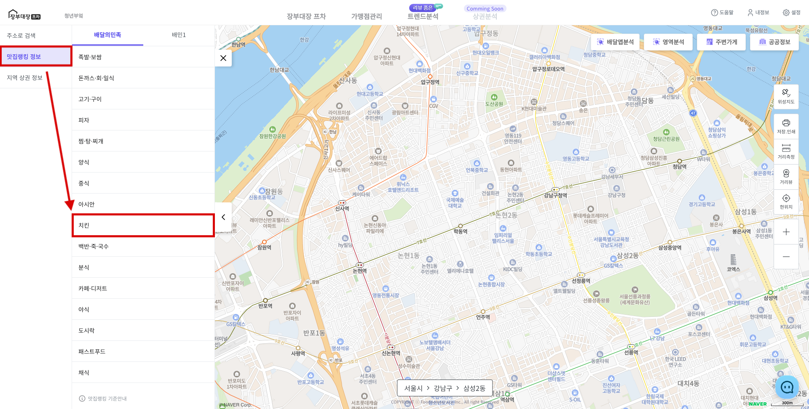
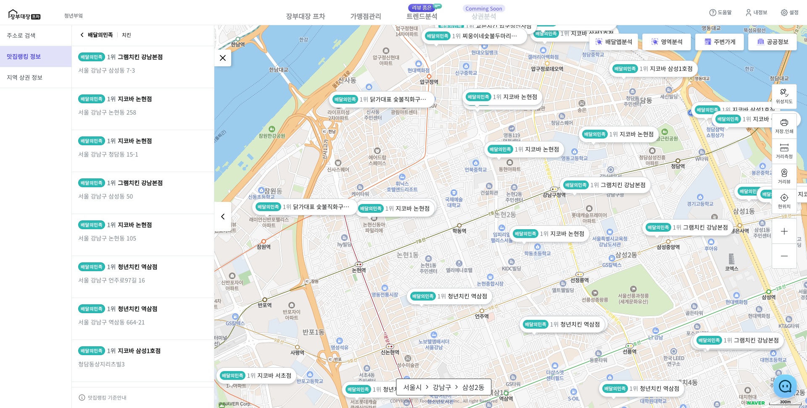
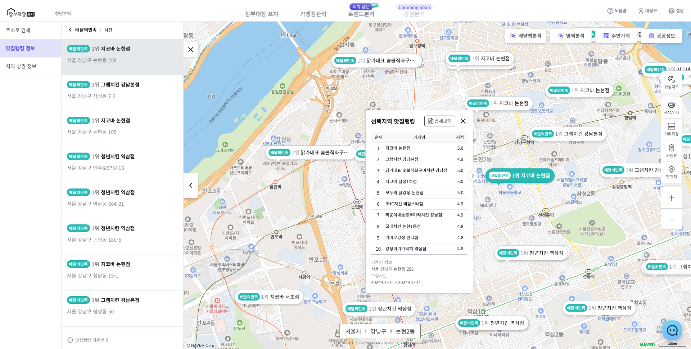
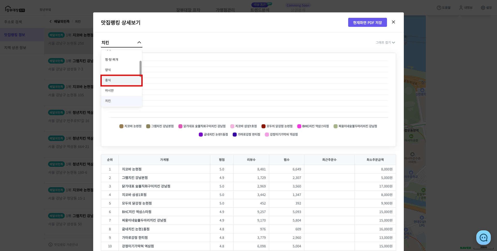

# 맛집랭킹 분석

## 1. 맛집랭킹 순위 확인하기

* 사이드바 **\[맛집랭킹 정보]**를 클릭합니다.
* 탭에서 **\[배달의민족]** 또는 **\[배민1]**을 선택하고 카테고리를 클릭 합니다.

<figure><figcaption></figcaption></figure>

* 현재 보이는 지도의 특정 주소 맛집랭킹 1위 마커를 확인할 수 있습니다.
* (보고있는 지도 영역 내 특정 주소의 맛집랭킹 1위를 확인할 수 있습니다.)

<figure><figcaption></figcaption></figure>


매장을 중심으로 임의의 지역에서 순위를 확인합니다.

맛집랭킹은 매주 수요일 갱신되며, 데이터 수집시간에 따라 순위는 다르게 보일 수 있습니다.


## 2. 선택한 주소의 맛집랭킹 정보 조회

* **\[주소 마커]** 선택시 해당 주소로 이동합니다.
* 해당 주소의 1위 \~ 10위 까지의 매장과 평점이 **\[정보창]**에 표시됩니다.

<figure><figcaption></figcaption></figure>

<figure><figcaption></figcaption></figure>


지도 이동 시 **\[사이드바]**의 맛집랭킹 리스트는 **지도 중앙 기준** 가까운 순으로 재정렬 됩니다.


## 3. 맛집랭킹 보고서 조회

* \[정보창]의 \[상세보기] 버튼을 클릭하면 보고서 형태의 모달에서 추가적인 정보 확인할 수 있습니다.
  * 맛집랭킹 1위 \~ 30위 매장의 평점, 리뷰수, 찜수, 최근 주문수, 최수 주문금액.&#x20;
  * 주소와, 위치
  * PDF 저장/프린트 기능
* 카테고리 **\[셀렉트]**를 이용해 다른 카테고리의 상세정보를 조회할 수 있습니다.

<figure><figcaption></figcaption></figure>


맛집랭킹 순위는 정보 수집 시점(요일, 시간대)에 정보를 저장하므로, \
매장의 오픈상태에 따라 실제 순위와 다르게 수집될 수 있습니다. 참고 자료로 사용하시길 권장드립니다.

