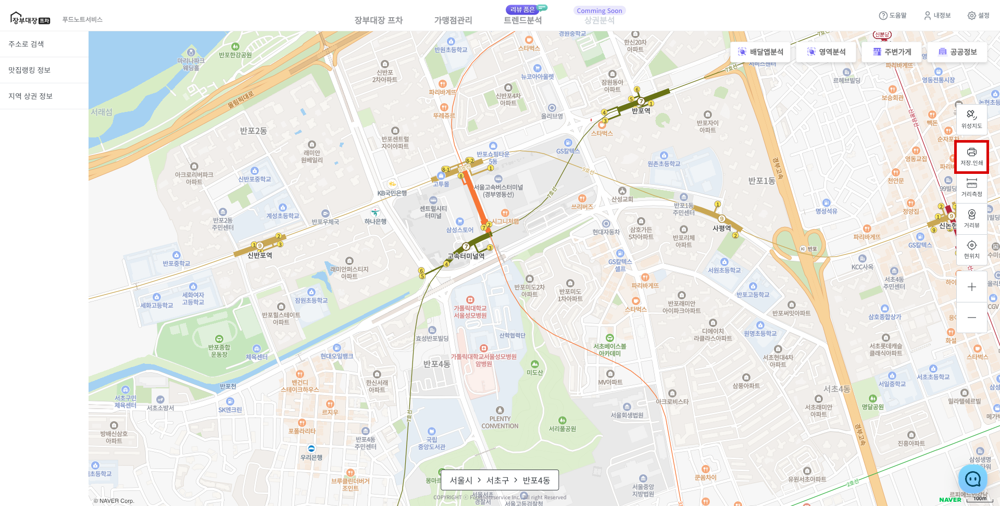
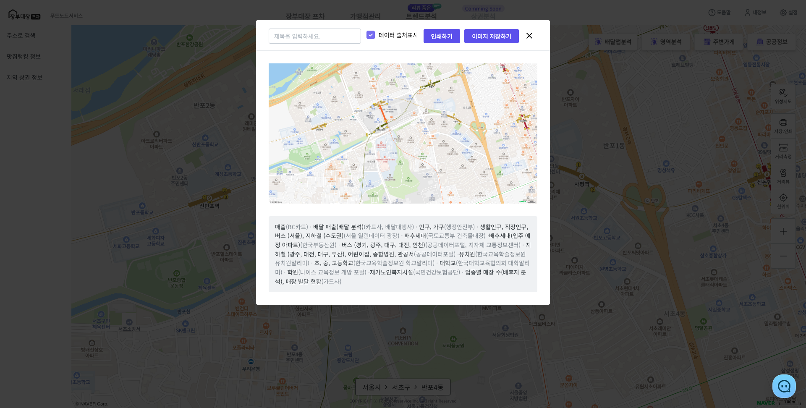
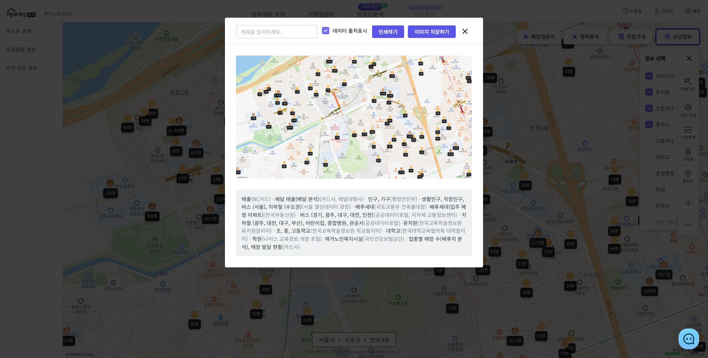

# 현재 위치 저장 및 인쇄

* 우측 **\[도구상자]**에서 **\[저장.인쇄]** 버튼을 클릭하여 지도를 저장할 수 있습니다.

<figure><figcaption></figcaption></figure>

* 이미지 저장 혹은 프린트 시 제목을 추가하거나 데이터 출처를 표시할 수 있습니다.

<figure><figcaption></figcaption></figure>

* 지도위에 마커가 있을 경우 모두 반영됩니다.

<figure><figcaption></figcaption></figure>

