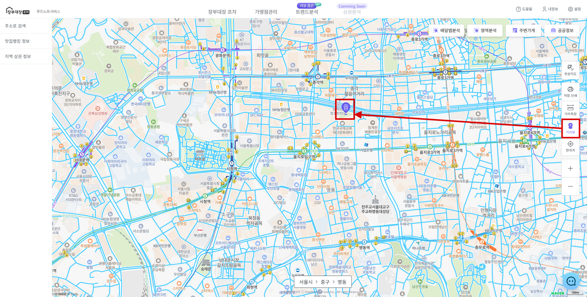
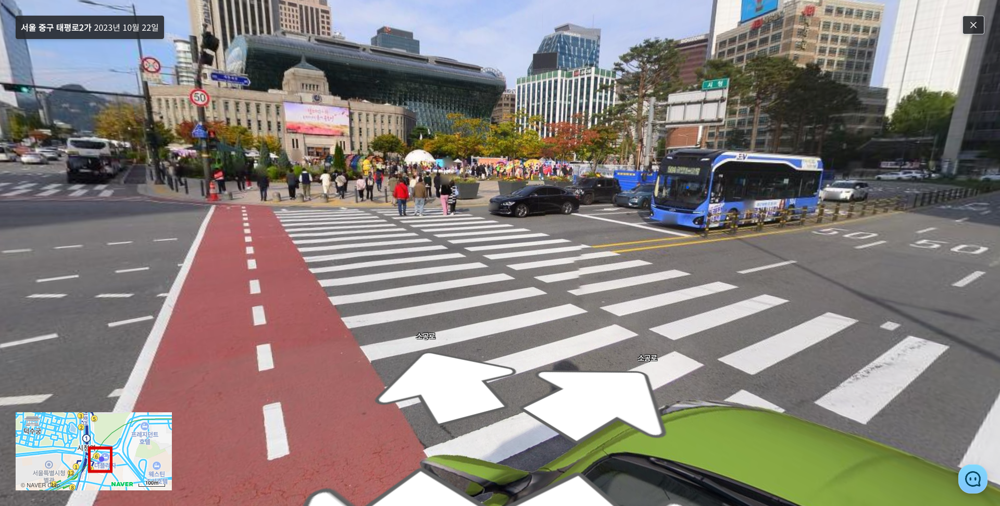

# 거리뷰 확인

* 우측 도구상자에서 **\[거리뷰]** 버튼을 클릭해 거리뷰 선택 화면으로 전환 가능합니다.
* 포인터의 모양이 바뀌며 원하는 지역을 클릭해 거리뷰를 확인 할 수 있습니다.

<figure><figcaption></figcaption></figure>

* 거리뷰 화면에서 **드래그**로 방향 전환 가능하며 **화살표를 클릭**하여 이동 할 수 있습니다.
* 좌측 하단 미니맵으로 화면 이동시 지도상의 방향을 볼 수 있습니다.

<figure><figcaption></figcaption></figure>

* **\[X]** 버튼을 클릭하여 다른 위치를 선택할 수 있습니다.
* **\[ESC]** 버튼으로 거리뷰를 종료할 수 있습니다.
